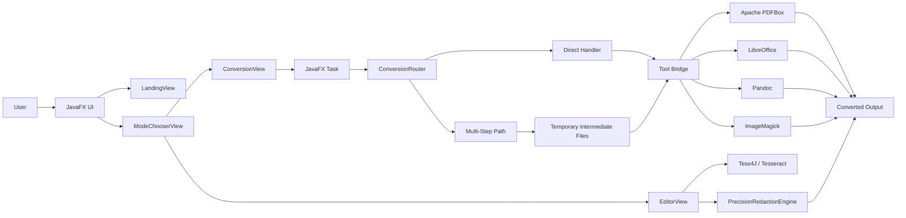

<div align="center">

# Kovert

### Secure PDF Converter for Local-First Document Workflows

Convert PDFs, Office documents, images, HTML, Markdown, and text files through a polished JavaFX desktop experience with smart multi-step routing, batch processing, per-file output control, and local-only execution.


</div>

---

## Table of Contents

- [Overview](#overview)
- [Why Kovert](#why-kovert)
- [Screenshots](#screenshots)
- [Core Features](#core-features)
- [Supported Formats](#supported-formats)
- [Smart Conversion Routing](#smart-conversion-routing)
- [Architecture](#architecture)
- [Important Classes and Functions](#important-classes-and-functions)
- [Tech Stack](#tech-stack)
- [Installation](#installation)
- [Running the App](#running-the-app)
- [CLI Usage](#cli-usage)
- [Release Artifacts and Versioning](#release-artifacts-and-versioning)
- [Project Structure](#project-structure)
- [Security and Privacy](#security-and-privacy)
- [Troubleshooting](#troubleshooting)
- [FAQ](#faq)
- [Known Limitations](#known-limitations)
- [Roadmap](#roadmap)
- [Contributing](#contributing)
- [Recruiter Notes](#recruiter-notes)
- [License](#license)

---

## Overview

Kovert, also known as **Secure PDF Converter**, is a JavaFX desktop application for converting files between multiple document, image, web, and text formats. It is built for users who need a fast local tool that can process private files without relying on cloud upload services.

The application supports single-file conversion, multi-file queues, folder-based batch conversion, drag-and-drop upload, per-file output format selection, and progress feedback while conversions run in the background.

Kovert is not limited to direct format pairs. Its conversion engine can resolve intelligent multi-step paths. For example, if a direct `PDF -> HTML` converter is not registered, Kovert can route through an intermediate format such as `PDF -> DOCX -> HTML`.

---

## Why Kovert

| Capability | What it means |
| --- | --- |
| Local-first processing | Files stay on the user's machine. No upload server is required. |
| Smart routing | The conversion graph can discover direct and multi-step paths automatically. |
| Per-file control | Each queued file can target a different output format. |
| Batch workflows | Multiple files or entire folders can be converted in one run. |
| Tool health checks | Required external binaries are detected before conversion work depends on them. |
| Desktop UX | JavaFX UI with drag-and-drop, progress feedback, popups, and mode-based navigation. |
| Extensible core | New converters can be added by registering route handlers in `ConversionRouter`. |

---

## Screenshots

> Add production screenshots to `docs/screenshots/` and keep these paths stable for GitHub.

| Landing | Conversion Workspace |
| --- | --- |
|  |  |

| Per-File Mode | Tool Health Check |
| --- | --- |
|  |  |

| PDF Redaction Workspace | Batch Conversion |
| --- | --- |
|  |  |

---

## Core Features

### Document Conversion

- Convert between PDF, DOCX, XLSX, PPTX, images, HTML, Markdown, TXT, and WEBP-supported workflows.
- Route direct conversions through registered handlers.
- Route complex conversions through automatically discovered intermediate steps.
- Generate output files in a user-selected destination folder.
- Skip same-format conversions instead of overwriting files unnecessarily.

### Per-File Conversion Selection

- Select a global output format for the whole queue.
- Enable per-file mode to assign different target formats to individual files.
- Preserve per-file selections in the queue through `perFileMap`.
- Refresh the queue UI when per-file mode is toggled.

### Batch Processing

- Add multiple files with the native file chooser.
- Drag multiple files into the conversion drop zone.
- Enable folder batch mode to load every file from a selected directory.
- Track progress across the full batch.

### UX and Feedback

- Drag-and-drop upload surface.
- Conversion progress bar.
- Status messages for current file, skipped files, completed files, and failures.
- Supported conversion popup with searchable categories.
- Visual health status for required external tools.

### PDF Workspace

- PDF preview with page navigation and thumbnails.
- Manual redaction tools for boxes, ellipses, and brush paths.
- OCR/text-assisted word scanning.
- Tesseract-backed OCR support through Tess4J.
- Redaction export to a new PDF file.

---

## Supported Formats

The supported conversion matrix is defined in `ConversionRouter`.

| Input | Output targets |
| --- | --- |
| `pdf` | `docx`, `xlsx`, `pptx`, `png`, `jpg`, `jpeg`, `tiff` |
| `doc` | `pdf` |
| `docx` | `pdf`, `html`, `txt` |
| `xls` | `pdf` |
| `xlsx` | `pdf` |
| `pptx` | `pdf` |
| `png` | `pdf`, `jpg`, `webp` |
| `jpg` | `pdf`, `png` |
| `jpeg` | `pdf` |
| `webp` | `png` |
| `html` | `pdf`, `docx` |
| `md` | `pdf` |
| `markdown` | `pdf` |

### External Tool Coverage

| Tool | Used for |
| --- | --- |
| LibreOffice | Office/PDF conversion such as DOCX, XLSX, PPTX, and PDF workflows |
| Pandoc | DOCX, HTML, Markdown, TXT, and document-format workflows |
| ImageMagick | Image transformations such as PNG, JPG, WEBP, and SVG-related workflows |
| Tesseract | OCR-assisted PDF word detection and redaction support |

---

## Smart Conversion Routing

Kovert stores direct conversion handlers in a route map:

```text
source-format -> target-format -> handler
```

Example direct routes:

```text
docx -> pdf
pdf  -> docx
docx -> html
html -> pdf
png  -> webp
webp -> png
```

When the requested conversion is not directly available, the router builds a graph and searches for a valid path.

Example smart routes:

```text
pdf  -> docx -> html
pdf  -> docx -> txt
html -> docx -> pdf
```

This keeps the app extensible: adding one new handler can unlock several new multi-step workflows.

---

## Architecture



### UI Layer

The JavaFX UI is organized around mode-specific views:

- `LandingView` handles the first file drop or browse action.
- `ModeChooserView` lets the user choose conversion or PDF redaction workflows.
- `ConversionView` manages queued files, format selection, output folder selection, progress, and tool health UI.
- `EditorView` manages PDF preview, navigation, OCR scanning, manual redaction, and redaction export.

### Conversion Layer

The conversion layer is centered on `ConversionRouter`. Each converter implements a focused operation and is registered as a `ConversionHandler`.

### Tool Bridge Layer

External engines are wrapped behind bridge classes so the rest of the app does not need to know command-line details.

---

## Important Classes and Functions

| File / Class | Responsibility |
| --- | --- |
| `MainWindow` | JavaFX entry point and screen navigation |
| `LandingView` | Initial drag-and-drop or file-picker upload screen |
| `ModeChooserView` | Selects between conversion and redaction workflows |
| `ConversionView` | Main conversion UI, file queue, per-file mode, progress, and tool popup |
| `ConversionRouter` | Registers conversion routes, discovers paths, and executes smart conversions |
| `ConversionHandler` | Functional interface used by registered converter classes |
| `LibreOfficeBridge` | Runs headless LibreOffice conversions |
| `PandocBridge` | Runs Pandoc-based document conversions |
| `ImageMagickBridge` | Runs image transformation commands |
| `ToolHealthChecker` | Checks whether external tools are available |
| `ToolPaths` | Resolves expected local paths for bundled tools |
| `EditorView` | PDF preview, OCR scan controls, and redaction actions |
| `PrecisionRedactionEngine` | Applies redaction plans and saves the final PDF |
| `DocumentLoader` | Loads PDFs through PDFBox |
| `DocumentValidator` | Validates basic PDF structure and page consistency |
| `DocumentFingerprint` | Generates stable document fingerprints with SHA3-512 |

### Key Functions

| Function | Purpose |
| --- | --- |
| `ConversionRouter.findConversionPath(from, to)` | Finds a direct or multi-step route between formats |
| `ConversionRouter.smartConvert(input, from, to, output)` | Executes direct or multi-step conversion |
| `ConversionRouter.getSupportedRoutes()` | Returns the supported route matrix |
| `ConversionView.startConversion()` | Starts background conversion work and binds UI progress |
| `ConversionView.enableDragDrop()` | Enables drag-and-drop file loading |
| `ToolHealthChecker.checkAllDetailed()` | Returns detailed availability status for external tools |
| `EditorView.runScan(targets)` | Runs OCR/text-assisted matching for redaction candidates |
| `EditorView.performRedaction()` | Applies manual and detected redactions to a saved PDF |

---

## Tech Stack

| Category | Technology |
| --- | --- |
| Language | Java 23 |
| UI | JavaFX 23 |
| Build | Maven |
| PDF processing | Apache PDFBox 3.0.1 |
| Security provider | Bouncy Castle 1.78 |
| OCR bridge | Tess4J 5.8.0 |
| Office conversion | LibreOffice headless |
| Document conversion | Pandoc |
| Image conversion | ImageMagick |
| Tests | JUnit 3.8.1 |
| Packaging | Maven Shade Plugin, JavaFX Maven Plugin, desktop distribution under `dist/` |

---

## Installation

### 1. Clone the Repository

```bash
git clone https://github.com/<your-username>/secure-pdf-converter.git
cd secure-pdf-converter
```

### 2. Verify Java and Maven

```bash
java -version
mvn -version
```

Expected Java version:

```text
Java 23
```

### 3. Add External Tools

For full conversion coverage, place tool binaries under `tools/`:

```text
tools/
  libreoffice/
    program/
      soffice.exe
  pandoc/
    pandoc.exe
  imagemagick/
    magick.exe
  tesseract/
    tesseract.exe
```

On macOS or Linux, the same layout is used without the `.exe` suffix.

---

## Running the App

### Development Mode

```bash
mvn clean javafx:run
```

### Build JAR Artifacts

```bash
mvn clean package
```

Generated artifacts:

```text
target/app.jar
target/original-app.jar
```

### Run the Packaged JAR

```bash
java -jar target/app.jar
```

### Run the Windows Desktop Build

```text
dist/Kovert/Kovert.exe
```

---

## CLI Usage

Kovert also includes a CLI entry point for conversion automation.

### Windows packaged CLI

```powershell
dist\Kovert\kovertcli.exe list
dist\Kovert\kovertcli.exe convert --input "sample.pdf" --to docx --output "sample.docx"
dist\Kovert\kovertcli.exe convert --batch "C:\Documents" --to pdf --output "C:\Converted"
```

### Supported CLI commands

```text
securepdf list
securepdf convert --input <file>
securepdf convert --input <file> --output <file>
securepdf convert --input <file> --from <format> --to <format>
securepdf convert --batch <folder>
securepdf convert --list
```

---

## Release Artifacts and Versioning

Current project version:

```text
1.0.0-SNAPSHOT
```

The version is defined in:

```text
pom.xml
```

### Local Build Output

| Artifact | Location | Purpose |
| --- | --- | --- |
| Shaded app JAR | `target/app.jar` | Runnable application JAR |
| Original JAR | `target/original-app.jar` | Non-shaded original build artifact |
| Desktop app executable | `dist/Kovert/Kovert.exe` | Windows GUI launcher |
| CLI executable | `dist/Kovert/kovertcli.exe` | Windows CLI launcher |
| Runtime image | `dist/Kovert/runtime/` | Bundled Java runtime for desktop distribution |
| App payload | `dist/Kovert/app/` | JARs, classes, config, and runtime app files |

### GitHub Releases

Recommended GitHub release format:

| Release tag | Version | Artifact name | Notes |
| --- | --- | --- | --- |
| `v1.0.0-alpha` | `1.0.0-SNAPSHOT` | `Kovert-v1.0.0-alpha-windows-x64.zip` | First public preview build |
| `v1.0.0` | `1.0.0` | `Kovert-v1.0.0-windows-x64.zip` | First stable desktop release |
| `v1.0.1` | `1.0.1` | `Kovert-v1.0.1-windows-x64.zip` | Patch release |
| `v1.1.0` | `1.1.0` | `Kovert-v1.1.0-windows-x64.zip` | New feature release |

Recommended release package contents:

```text
Kovert-v1.0.0-windows-x64.zip
  Kovert/
    Kovert.exe
    kovertcli.exe
    app/
    runtime/
    tools/
```

### Versioning Policy

Kovert should follow semantic versioning:

```text
MAJOR.MINOR.PATCH
```

- `MAJOR` changes for breaking workflow, packaging, or API changes.
- `MINOR` changes for new formats, new UI workflows, or new tools.
- `PATCH` changes for bug fixes, stability improvements, and conversion fixes.
- `SNAPSHOT` means active development and should not be treated as a stable release.

### Release Checklist

- Update `pom.xml` version.
- Run `mvn clean package`.
- Validate `target/app.jar`.
- Validate `dist/Kovert/Kovert.exe`.
- Validate `dist/Kovert/kovertcli.exe`.
- Confirm external tools are bundled or documented.
- Zip `dist/Kovert/` with the release version in the file name.
- Create a GitHub Release with the matching tag.
- Attach the zipped release artifact.
- Add screenshots and release notes.

---

## Project Structure

```text
secure-pdf-converter/
  pom.xml
  README.md
  icon.ico
  src/
    main/
      java/
        com/yourfamily/pdf/secure_pdf_converter/
          App.java
          DocumentLoader.java
          DocumentValidator.java
          DocumentFingerprint.java
          cli/
            securepdfcli.java
          core/
            conversion/
              ConversionRouter.java
              ConversionHandler.java
              *Converter.java
              imagemagick/
              libreoffice/
              pandoc/
            redaction/
            tools/
          ui/
            MainWindow.java
            LandingView.java
            ModeChooserView.java
            ConversionView.java
            EditorView.java
      resources/
        style.css
        ui-theme.css
    test/
  tools/
    libreoffice/
    pandoc/
    imagemagick/
    tesseract/
  target/
    app.jar
    original-app.jar
  dist/
    Kovert/
      Kovert.exe
      kovertcli.exe
      app/
      runtime/
      tools/
```

---

## Security and Privacy

Kovert is designed as a local-first desktop tool.

- Files are processed on the local machine.
- No cloud upload service is required for conversion.
- No tracking or analytics layer is required by the application code.
- External tools are executed locally.
- PDF redaction exports a new file instead of silently replacing the original.

For sensitive documents, users should still review converted or redacted output before distribution.

---

## Troubleshooting

### Tool status is red or orange

Open the tool health popup and verify that each required executable exists under the expected `tools/` path.

### LibreOffice conversions fail

Confirm this file exists:

```text
tools/libreoffice/program/soffice.exe
```

Then retry the conversion.

### Pandoc conversions fail

Confirm this file exists:

```text
tools/pandoc/pandoc.exe
```

Pandoc-dependent workflows include DOCX, HTML, Markdown, and TXT routes.

### Image conversions fail

Confirm this file exists:

```text
tools/imagemagick/magick.exe
```

ImageMagick-dependent workflows include PNG, JPG, WEBP, and SVG-related transformations.

### OCR or redaction scanning fails

Confirm this file exists:

```text
tools/tesseract/tesseract.exe
```

OCR-assisted redaction depends on Tesseract through Tess4J.

### Unsupported conversion path

Run the supported conversion list from the CLI:

```powershell
dist\Kovert\kovertcli.exe list
```

Or check the supported formats table in this README.

---

## FAQ

### Is Kovert a web app or desktop app?

Kovert is a JavaFX desktop application. It runs locally and does not require a hosted backend to perform conversions.

### Where do release builds go?

Local build outputs are generated in `target/`. Desktop release bundles are generated under `dist/Kovert/`. Public downloadable builds should be uploaded to the repository's GitHub Releases page as versioned `.zip` packages.

### What is the current version?

The current Maven project version is `1.0.0-SNAPSHOT`, which indicates active development. A stable public release should use a non-SNAPSHOT tag such as `v1.0.0`.

### Does Kovert upload files?

No. The app is designed for local-first processing. Conversion tools run on the user's machine.

### Why are external tools needed?

Some file formats require mature native conversion engines. Kovert delegates those workflows to LibreOffice, Pandoc, ImageMagick, and Tesseract through local bridge classes.

### Can new formats be added?

Yes. Add a converter class, implement the `ConversionHandler` contract, and register the route in `ConversionRouter`.

### Is there a CLI?

Yes. The project includes a CLI entry point and a packaged Windows CLI launcher at `dist/Kovert/kovertcli.exe`.

### Is Kovert recruiter-friendly as a portfolio project?

Yes. It demonstrates desktop UI engineering, asynchronous task execution, graph-based routing, local process integration, PDF processing, OCR workflows, release packaging, and user-focused error handling.

---

## Known Limitations

- Some conversion quality depends on LibreOffice, Pandoc, ImageMagick, and the source document structure.
- The current release is marked `1.0.0-SNAPSHOT`, meaning the project is still in active development.
- Full release packaging should be versioned and attached through GitHub Releases.
- External binaries are required for full conversion coverage.
- PDF conversion edge cases, scanned documents, complex layouts, and encrypted PDFs may require additional handling.

---

## Roadmap

- Parallel conversion worker pool for faster batch processing.
- Cross-platform installers for Windows, macOS, and Linux.
- Formal release pipeline with versioned GitHub artifacts.
- Plugin system for adding new conversion engines without changing core router code.
- Route scoring based on quality, speed, and tool availability.
- More detailed progress per conversion step.
- Multi-page PDF-to-image export options.
- Persistent user settings for output folders and preferred tools.
- Improved CLI packaging and documentation.
- Automated integration tests for every registered route.
- Better diagnostics for external tool failures.
- Optional cloud-sync exporters while keeping local conversion as the default.

---

## Contributing

Contributions are welcome.

### Development Flow

1. Fork the repository.
2. Create a feature branch.
3. Make a focused change.
4. Run the build.
5. Update documentation if behavior changes.
6. Open a pull request.

### Add a New Conversion

1. Create a new converter class under `core/conversion`.
2. Implement a method matching the `ConversionHandler` contract.
3. Register the route in `ConversionRouter`.
4. Add the route to the supported formats table.
5. Add or update tests for the route.

Example route registration:

```java
ROUTES.put("source->target", NewConverter::convert);
```

---

## Recruiter Notes

Kovert demonstrates practical desktop engineering across several important areas:

- JavaFX application architecture.
- Background task execution for responsive UIs.
- Local file processing and batch workflows.
- External process integration with desktop tools.
- Graph-based routing for multi-step conversion workflows.
- PDF processing with Apache PDFBox.
- OCR-assisted document workflows.
- Release packaging with desktop executables and runtime bundles.
- User-centered error handling and tool diagnostics.

---

## License

This repository does not currently include a published license file.

Before public distribution or external contribution intake, add a `LICENSE` file and update this section with the selected license terms.
